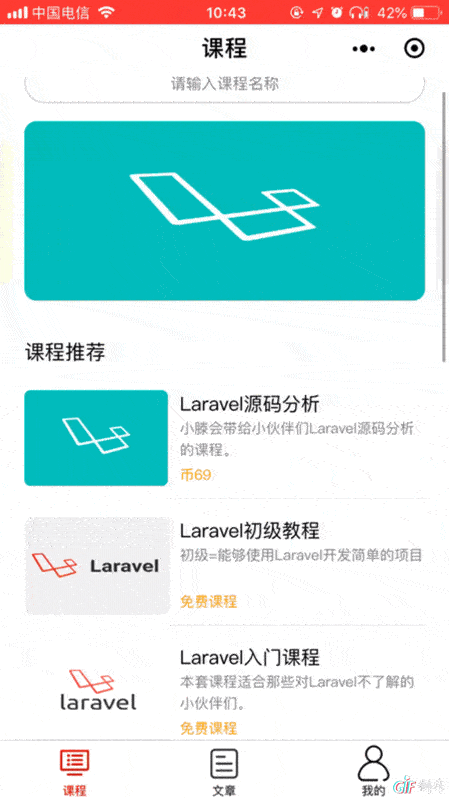

<p align="center"></p>

<p align="center">
<a href="https://travis-ci.org/Qsnh/meedu"></a>
<a href="https://packagist.org/packages/Qsnh/meedu"></a>
</p>

> A Mpvue wxApp for meEdu
-------------
 [meEdu](https://github.com/Qsnh/meedu):基于Laravel开发的在线点播系统

## 简介
在在校教育火热的年代，meedu在线点播教育系统横空出世，随后为了市场的推动，meEdu同套微信小程序跟风而至，meEdu提供了了在线观看课程视频，提交评论，以及文章的观看，同步meEdu的课程信息和个人信息。

## 功能
- [x] 视频点播板块
- [x] 文章观看
- [x] 个人信息模块
- [x] vip模块
- [x] 课程评论互动

## 规划
- [ ] 视屏评论互动
- [ ] 课程搜索功能
- [ ] 直播功能

<p align="center"></p>

## 结构
- api
  * core
    + server.js // http封装
  * article.js // 文章接口
  * course.js // 课程接口
- assets
  * img // 图片
  * style // 样式
- components // 组件部分
  * card/vue
  * courseCard.vue
  * swiper-banner.vue
- pages
  * comment // 评论详情
  * login // 登录
  * register // 注册
  * tabBar
    - article // 课程
    - course // 文章
    - person // 个人
  * video // 视屏播放
  * videoList // 视屏列表
  * vipList // vip列表
- utils
  * index.js // 工具类函数
- app.json
- App.vue
- main.js

## 预览
<p align="center"></p>  

<p align="center"></p>  

<p align="center"></p>  

<p align="center"></p>

## API
- API接口: [https://github.com/Qsnh/meedu/tree/master/docs/api/v1]


## 使用

>推荐使用yarn

``` bash
# install dependencies
yarn
/* npm install */

# serve with hot reload at localhost:8080
yarn start
/* npm run dev */

# build for production with minification
yarn build
/* npm run build */

# build for production and view the bundle analyzer report
yarn build --report
/* npm run build --report */
```

### 💖💖 If you find this project helpful, maybe you can buy me a coffee. 💖💖
<p>
  
  
</p>

## License
[MIT](http://opensource.org/licenses/MIT)


欢迎star.
交流群：QQ：771930341
